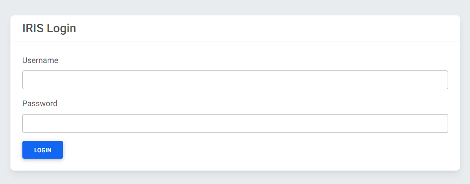
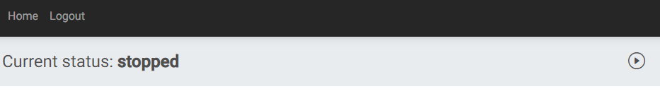
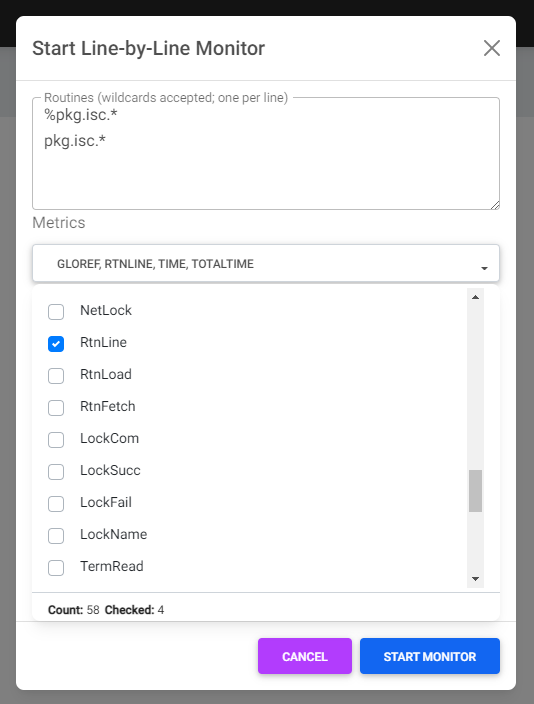
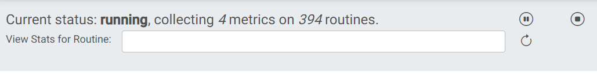
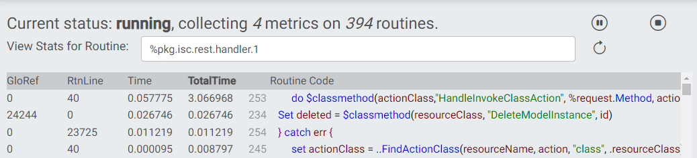
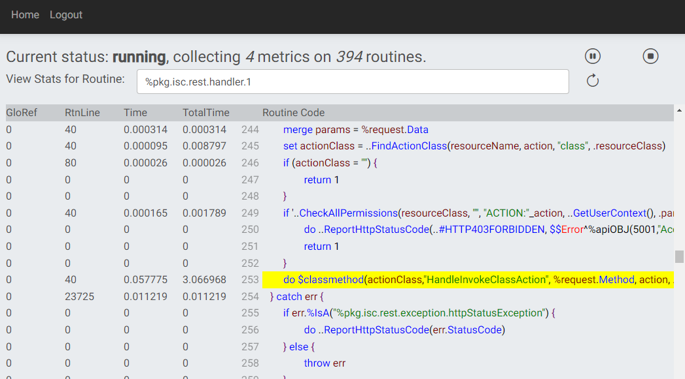

# isc.perf.ui
isc.perf.ui is a simple Angular UI and accompanying REST API for interacting with the line-by-line monitor (otherwise accessed via `^%SYS.MONLBL`) and reviewing results.

Note that this is appropriate for use in development/testing environments, NOT production.

Beyond its intended use, this project also serves to demonstrate three other projects :
* [isc.json](https://github.com/intersystems/isc-json)
* [isc.rest](https://github.com/intersystems/isc-rest)
* [isc.ipm.js](https://github.com/intersystems/isc-ipm-js)

## Getting Started
Note: a minimum platform version of InterSystems IRIS 2018.1 is required.

### Installation: ZPM

If you already have the [ObjectScript Package Manager](https://openexchange.intersystems.com/package/ObjectScript-Package-Manager-2), installation is as easy as:
```
zpm "install isc.perf.ui"
```

## Notes on Security
If there is not public read permission on the namespace-default routine database for the namespace in which isc.perf.ui is installed, a role will be created that has read permission on that database and assigned as an application role to /csp/{namespace}/monlbl-viewer/, which provides unauthenticated access to the Angular UI. The REST API requires %Development:USE.

## User Guide
After install isc.ipm.js, the package manager output will include a line like:
```
[isc.perf.ui]   Activate SUCCESS
You can view the Line-by-Line Monitor at: http://your.ip.address:52773/csp/USER/monlbl-viewer/
```

Navigate to that URL in a browser and log in with IRIS credentials.



The monitor will (presumably) be stopped initially. To start the monitor, click the "Play" button.



Select the routines and metrics to monitor. The wildcard syntax is the same as in `^%SYS.MONLBL`. Once selections are made, click "Start Monitor."



Once running, the status will update. Clicking the "pause" button will pause the monitor (and "resume" will become an option). Selecting a routine will show its data. Clicking the "stop" button will stop the monitor and discard counts. Clicking the "refresh" button will refresh the currently-displayed metrics.



When a routine is selected, clicking on a column header will sort by that column descending.



Clicking on a line of code will highlight it and jump to it in line order. Click it again to remove the highlighting.



## Support
If you find a bug or would like to request an enhancement, [report an issue](https://github.com/intersystems/isc-perf-ui/issues/new). If you have a question, feel free to post it on the [InterSystems Developer Community](https://community.intersystems.com/).

## Contributing
Please read [contributing](https://github.com/intersystems/isc-perf-ui/blob/master/CONTRIBUTING.md) for details on our code of conduct, and the process for submitting pull requests to us.

## Versioning
We use [SemVer](http://semver.org/) for versioning. Declare your dependencies using the InterSystems package manager for the appropriate level of risk.

## Authors
* **Tim Leavitt** - *Initial implementation* - [isc-tleavitt](http://github.com/isc-tleavitt)

See also the list of [contributors](https://github.com/intersystems/isc-json/graphs/contributors) who participated in this project.

## License
This project is licensed under the MIT License - see the [LICENSE](https://github.com/intersystems/isc-json/blob/master/LICENSE) file for details.
