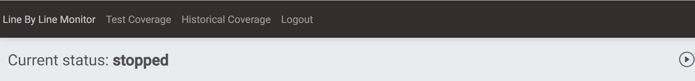
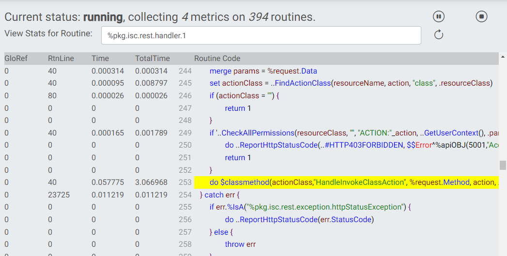

# isc.perf.ui
isc.perf.ui is a simple Angular UI and accompanying REST API and WebSocket for interacting with the line-by-line monitor (otherwise accessed via `^%SYS.MONLBL`) as well as the [Test Coverage tool](https://openexchange.intersystems.com/package/Test-Coverage-Tool) and reviewing results.

Note that this is appropriate for use in development/testing environments, NOT production.

Beyond its intended use, this project also serves to demonstrate three other projects :
* [isc.json](https://github.com/intersystems/isc-json)
* [isc.rest](https://github.com/intersystems/isc-rest)
* [isc.ipm.js](https://github.com/intersystems/isc-ipm-js)

## Getting Started
Note: a minimum platform version of InterSystems IRIS 2022.1 is required.

### Installation: ZPM

As a prerequisite, you must have Node.js ^16.14.0 || ^18.10.0 installed and on the PATH. We hope to remove this requirement in the future by publishing the package with UI build artifacts included; IPM and isc.ipm.js support this, but the Open Exchange currently does not (by design).

If you already have the [ObjectScript Package Manager](https://openexchange.intersystems.com/package/ObjectScript-Package-Manager-2), installation is as easy as:
```
zpm "install isc.perf.ui"
```

## Notes on Security
If there is not public read permission on the namespace-default routine database for the namespace in which isc.perf.ui is installed, a role will be created that has read permission on that database and assigned as an application role to /csp/{namespace}/monlbl-viewer/, which provides unauthenticated access to the Angular UI. The REST API requires %Development:USE.

## User Guide
After installing isc.ipm.js, the package manager output will include a line like:
```
[isc.perf.ui]   Activate SUCCESS
You can view the Line-by-Line Monitor at: http://your.ip.address:52773/csp/USER/monlbl-viewer/
```

Navigate to that URL in a browser and log in with IRIS credentials on the standard IRIS login page. 

### Line-by-Line Monitor

The home page will show you the Line-By-Line monitor tool. 

The monitor will (presumably) be stopped initially. To start the monitor, click the "Play" button.



Select the routines and metrics to monitor. The wildcard syntax is the same as in `^%SYS.MONLBL`. Once selections are made, click "Start Monitor."


Once running, the status will update. Clicking the "pause" button will pause the monitor (and "resume" will become an option). Selecting a routine will show its data. Clicking the "stop" button will stop the monitor and discard counts. Clicking the "refresh" button will refresh the currently-displayed metrics.


When a routine is selected, clicking on a column header will sort by that column descending.


Clicking on a line of code will highlight it and jump to it in line order. Click it again to remove the highlighting.



### TestCoverage Features


#### TestCoverage Page

On the Test Coverage page, you can select the parameters that you want to run TestCoverage on your unit tests with. 


The parameter explanations include descriptions of what each of these parameters control. You can also click into an input box to see a sample value, and there's input validation to make sure that your inputs are in a valid format.

After you press submit, the call to run TestCoverage will begin, and you'll see live progress of your unit tests in the log at the bottom of the page. 


After the tests have finished running, the dropdown select menu on the right should open with a list of routine + test path combinations, as well as the overall coverage percentage for your code. 


Click on any to be taken to the coverage results page for that routine under that unit test directory. 

Here, you can see which lines of code were covered by your unit tests according to TestCoverage. There are also additional metrics like TotalTime, which tracks the amount of time the code spent on a certain line of code from its start to finish. 
 


You can further sort in ascending or descending order by clicking on the arrows next to the headers; this is a useful way to see which lines of code take the longest. 


Finally, the Show Methods button opens up a table with the [cyclomatic complexity](https://radon.readthedocs.io/en/latest/intro.html) of each of your methods, showing which methods are the most complex and vulnerable to bugs. 


When you're done, can click the back button to go back to the launcher page. The red clear results button lets you clear all your test coverage runs.


#### Historical Coverage Page 

After clicking on a specific past Run ID, you can view the class-level coverage results (line coverage, method coverage, timing) for all the classes in that run. This is the same data as the main results page from TestCoverage. This table is also sortable by each column. 


## Support
If you find a bug or would like to request an enhancement, [report an issue](https://github.com/intersystems/isc-perf-ui/issues/new). If you have a question, feel free to post it on the [InterSystems Developer Community](https://community.intersystems.com/).

## Contributing
Please read [contributing](https://github.com/intersystems/isc-perf-ui/blob/master/CONTRIBUTING.md) for details on our code of conduct, and the process for submitting pull requests to us.

## Versioning
We use [SemVer](http://semver.org/) for versioning. Declare your dependencies using the InterSystems package manager for the appropriate level of risk.

## Authors
* **Tim Leavitt** - *Initial implementation* - [isc-tleavitt](http://github.com/isc-tleavitt)
* **Chris Ge** - TestCoverage features - [isc-cge](https://github.com/isc-cge)

See also the list of [contributors](https://github.com/intersystems/isc-perf-ui/graphs/contributors) who participated in this project.

## License
This project is licensed under the MIT License - see the [LICENSE](https://github.com/intersystems/isc-perf-ui/blob/master/LICENSE) file for details.
